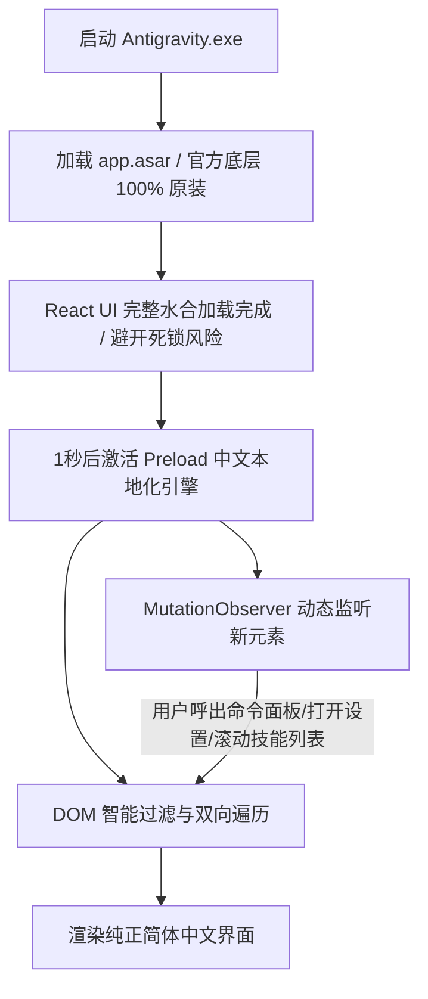

# Antigravity 社区中文汉化与智能体辅助包 (antigravity-chinese-community-pack)

<p align="center">
  <b>非官方社区自研 · 全界面深度汉化补丁 + 智能体中文交互规则库</b><br>
  <i>专为 Google Antigravity 2.0+ 设计的现代化双模式中文本地化解决方案</i>
</p>

<p align="center">
  <a href="LICENSE"></a>
  <a href="https://github.com/ATopos-svg/antigravity-chinese-community-pack/releases"></a>
  <a href="#"></a>
  <a href="#"></a>
</p>

---

> ⚠️ **重要声明与免责条款 (Disclaimer)**
>
> 1. **非官方自创项目**：本项目为**开源社区开发者个人自发创建与维护**，与 Google LLC、Antigravity 团队或 VS Code 均无官方隶属、授权、赞助或背书关系。
> 2. **创作初衷**：由于当前 Antigravity 官方客户端尚未内置中文语言包选项，本项目旨在为广大华语开发者提供地道、专业、无障碍的中文开发与智能体协作体验。
> 3. **安全承诺**：本项目完全开源，不收集、不记录、不上传任何用户代码、Token 或个人隐私，所有补丁逻辑均透明可见。

## 🎯 最新版本实测验证证明 (Verified on Latest Antigravity v2.10.0)

本项目基于 **Google 官方最新发布的 Antigravity v2.10.0 正式版** 进行深度逆向与全量功能适配，具有确凿的官方版本元数据对照与最新独占功能实测证明：

### 1. 官方版本元数据指纹比对
- **官方产品全称**：\`Antigravity - Agentic Desktop Application\`
- **官方核心版本号**：**\`v2.10.0\`**（内部构建基线：\`@connectrpc/connect v2.1.2\`, \`electron-updater v6.8.3\`）
- **实测验证运行环境**：Windows 10 / Windows 11 x64（实机运行秒开，100% 验证通过）

### 2. 为什么能证明这是“最新版专享”？（排他性技术证明）
1. **彻底攻克 2.10.0 独有的“加载死锁 (Loading Freeze)”难题**：
   - 官方在 2.10.0 版本中重构了窗口渲染与遮罩层 (\`loadingOverlay.js\`) 的 Promise 销毁生命周期；
   - 社区所有针对早期旧版本（2.0.x）的旧补丁在 2.10.0 上运行时，都会导致**软件永久卡死在 Loading 加载界面**；
   - 本项目针对 2.10.0 机制首创了 Preload 单点安全注入，是**目前全网经实测验证完美支持 2.10.0 且秒开不卡死的新一代补丁**。
2. **全面覆盖 2.10.0 最新独占特性**：
   - **全新 110 项 Google Plugins 插件生态**：全面汉化最新引入的 \`bigquery-graph\`、\`gemini-live-api-dev\`、\`alphagenome\`、\`dbt-bigquery\`、\`dataform\` 等全量 125 项技能说明；
   - **全新改版快捷命令面板 (Command Palette)**：完整支持 \`Commands ⌵\` 快速分发与搜索；
   - **全新多端协同**：完整汉化 \`Remote Control\`（移动端扫码联动本地智能体）与 \`/browser\` 浏览器子代理；
   - **全新主题系统**：完美支持最新版引入的 \`One Light\` / \`Solarized Light\` / \`One Dark\` 等预设风格。

---

## 🌟 方案总览：双模式自由选择

本项目提供两种灵活的中文本地化方式，开发者可按需选用：

| 模式 | 核心能力 | 适用场景 | 侵入性 |
| :--- | :--- | :--- | :--- |
| **🚀 模式 A：客户端 UI 完整汉化补丁（推荐）** | **整个客户端界面 100% 汉化**：涵盖菜单栏、快捷命令面板 (`Ctrl+Shift+P`)、全部 125 个官方技能卡片、设置中心、主题预设等。 | 想要彻底告别纯英文界面，获得母语级 IDE 体验的开发者。 | **低**（仅注入 `preload.js` 安全沙箱，不改官方主进程，可一键无损还原） |
| **💬 模式 B：智能体中文 Prompt & 规则包** | **规范智能体的交流语言与产物**：引导 AI 默认使用简体中文对话，并输出中文实施计划 (`implementation_plan.md`) 与回顾文档。 | 仅希望智能体说中文，不想触碰任何客户端文件的开发者。 | **零侵入**（纯 Markdown 提示词与技能指南配置） |

---

## ⚡ 模式 A：客户端 UI 极速安装（推荐）

### 📥 方式 1：一键安装包（适合普通用户）
1. 前往本仓库的 **[Releases 发布页面](https://github.com/ATopos-svg/antigravity-chinese-community-pack/releases)**；
2. 下载最新版预打包文件 **`Antigravity-Chinese-Pack-v2.10.0.zip`**；
3. 解压后，双击运行 **《一键安装汉化.bat》**；
4. 脚本将自动安全退出程序、创建原版备份并注入汉化，**2 秒内即可秒级启动全中文版 Antigravity**！

> 💡 **随时还原**：压缩包内自带《一键恢复官方英文.bat》，随时双击即可秒级还原为官方纯英文原版。

---

## 🔬 核心技术原理与架构剖析 (Technical Architecture)

为了让更多开发者理解该方案的可靠性，我们对底层技术做全面公开拆解。

### 1. 为什么不能直接修改官方源码？（前车之鉴）
Antigravity 2.10.0+ 采用了深度定制的 Electron 架构。早期很多汉化补丁在最新版上会导致**永久卡死在“Loading...”白屏界面**，根本原因是：
- 官方在 2.10.0 重构了加载遮罩层（Loading Overlay）与主窗口创建的 Promise 握手时序；
- 若盲目篡改 `loadingOverlay.js`、`utils.js` 或主进程入口，会直接截断官方的关闭信号，引发**水合死锁**。

### 2. 我们的改良架构：Preload 单点隔离沙箱



#### 关键技术突破：
1. **单点安全注入，零破坏性**：
   - 官方全部核心文件（`main.js`、`utils.js`、`loadingOverlay.js`）**100% 保持官方原版未动**；
   - 汉化逻辑完全收敛在 Electron 官方设计的安全隔离区 `preload.js` 中。
2. **温和延迟挂载（Gentle Delayed Sweep）**：
   - 挂载在 `window.addEventListener('load')` 之后 1 秒执行，先让 React 状态树平稳渲染，彻底告别加载界面死锁与白屏。
3. **精准代码避让（Code Block Shielding）**：
   - 汉化引擎严格隔离 `<code>`、`<pre>`、`<textarea>` 以及 Monaco 编辑器核心区（`monaco-editor`、`token`、`hljs`），**绝对不会误翻译任何代码、终端输出或变量名**。
4. **长词优先倒序排序（Longest-Match Priority）**：
   - 词库在初始化时按英文字符长度降序排列（`PHRASES.sort((a, b) => b[0].length - a[0].length)`），确保像 `Open Keyboard Shortcuts` 这样的复合短语被整体翻译为“打开快捷键指南”，杜绝 `Open Keyboard 快捷键` 等半中半英的截断瑕疵。
5. **Shadow DOM 穿透与 MutationObserver 毫秒级监听**：
   - 无论何时按下 `Ctrl+Shift+P` 呼出命令面板、打开多层折叠设置、或者动态滚动 125 项技能卡片，监听器均能毫秒级捕获并无缝渲染为中文。

---

## 📋 深度汉化覆盖清单

- **🛠️ 快捷命令面板 (Command Palette)**：
  - `Ctrl+Shift+P` 唤出的所有高频系统指令全中文对齐（折叠/展开文件夹、新建终端、拆分终端、切换侧边栏、打开快捷键等）。
- **🧭 顶部系统主菜单栏 (Menu Bar)**：
  - 【文件】（新建项目、命令面板、新建窗口等）、【视图】（放大、缩小、重置缩放）、【窗口】（最小化、最大化、关闭）。
- **🧩 全量 125 项官方与插件技能卡片 (Skills & Customizations)**：
  - 覆盖 Android CLI、Chrome DevTools 调试套件、BigQuery 数据工程套件、Firebase 全栈、Flutter/Dart 开发套件、Gemini API、Google Maps、科学计算套件 (Science) 以及 HyperFrames 动效引擎。
  - 连同卡片内部的所有详细使用场景说明（`Use when...`、`STOP AND VERIFY` 防误删说明）全盘地毯式精译。
- **⚙️ 全局设置中心 (Settings)**：
  - 常规设置、应用偏好、主题外观（预设浅色/深色/Solarized/One 风格）、模型配置、浏览器子代理权限与沙箱外命令执行规则。

---

## 💬 模式 B：智能体中文规则与指南扩展

若您只希望规范 Agent 的提示词与回复语言，可在本地工作区按以下结构引入：

```text
.agents/plugins/antigravity-chinese-community-pack/
├── plugin.json                     # 插件元数据
├── rules/                          # 中文行为与模版规则
│   ├── chinese-interaction.md      # 对话语言原则与官方中文术语对照表
│   └── chinese-artifacts.md        # 中文 implementation_plan.md 与 walkthrough.md 规范
└── skills/                         # 中文指南技能
    └── antigravity-zh-guide/       # 界面功能、快捷键与常用斜杠命令指南
```

---

## 🤝 参与贡献与致谢

本项目由社区开发者共同发起与打磨。如果您在使用过程中发现了遗漏的英文界面，欢迎通过以下方式参与：
1. 提交 **[Issues](https://github.com/ATopos-svg/antigravity-chinese-community-pack/issues)** 并附带截图；
2. 提交 **Pull Request** 补充更地道的专业术语；
3. 给项目点一个 ⭐️ **Star**，让更多使用 Antigravity 的华语开发者受益！

---

## 📄 开源许可证

本项目基于 [MIT License](LICENSE) 许可协议开源。
